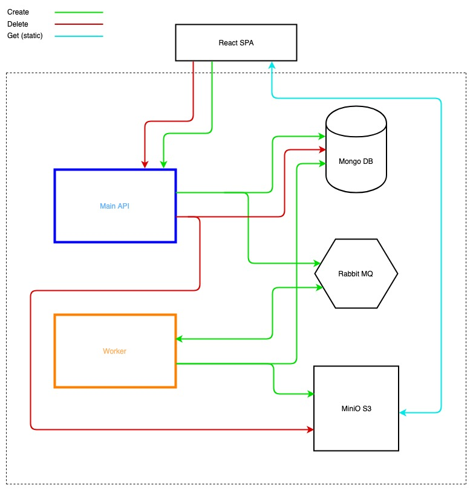

### Screenshot Maker V 0.0.1

----

Test sandbox application where can be created and managed screenshots of WEB sites pages.

Used:
- `MiniO` storage https://min.io/
- `RabbitMQ` https://www.rabbitmq.com/
- `MongoDB` https://www.mongodb.com/
- `MainApi` NodeJS service
- `Worker` NodeJS service
- Front - available:
    - `VueJs` https://vuejs.org/ with https://vuematerial.io/
    - `React` https://reactjs.org/ with https://github.com/mui-org/material-ui

Simple schema:


#### Start APP

1. clone repo and move in it 
    ```sh
    git clone https://github.com/prilipkoleg/screenshot-maker && cd $_
    ```
2. add _.env_ files:
    ```sh
    cd ./services/main-api && cp .env.EXAMPLE .env
    && cd -
    && cd ./services/worker && cp .env.EXAMPLE .env
    ```
3. up services (in separate terminal windows):
    - `docker-compose up` - _RabbitMQ_, _MongoDB_, _MiniO_.
    - `cd ./services/main-api && docker-compose up`
    - `cd ./services/worker && docker-compose up`
    - front:
        - **VueJs:** `cd ./services/vuejs-spa && npm i && npm start`
            <br>or with `http-server`:
            ```sh
            cd ./services/vuejs-spa && npm run build
            && http-server ./dist
            ```
        - **React:** `cd ./services/react-spa && npm i && npm start`
            <br>or with `http-server`:
            ```sh
            cd ./services/react-spa && npm run build
            && http-server ./build
            ```

... about `http-server` - https://github.com/indexzero/http-server

---

> Notice! For getting files from miniO as static, a *Bucket Policy* must have `*` Prefix. 